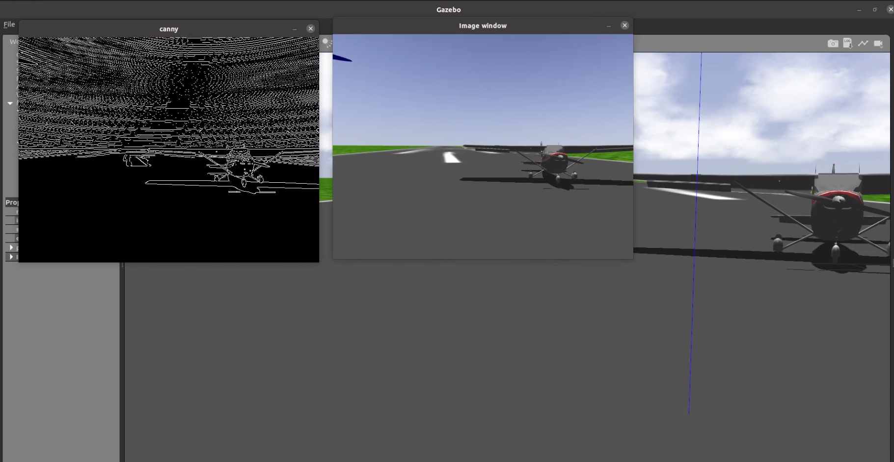

# IQ Vision 

IQ Vision is a ros package designed to help teach how to integrate opencv applications into intelligent drone applications. PLease see the [iq_tutorials](https://github.com/Intelligent-Quads/iq_tutorials) repo for tutorials on using the iq_vision package. 

## Example Programs

- canny_edge_sol.cpp - example opencv program designed to show how to subscribe to a ROS image stream and run opencv vision processing on live image stream data. 

    

